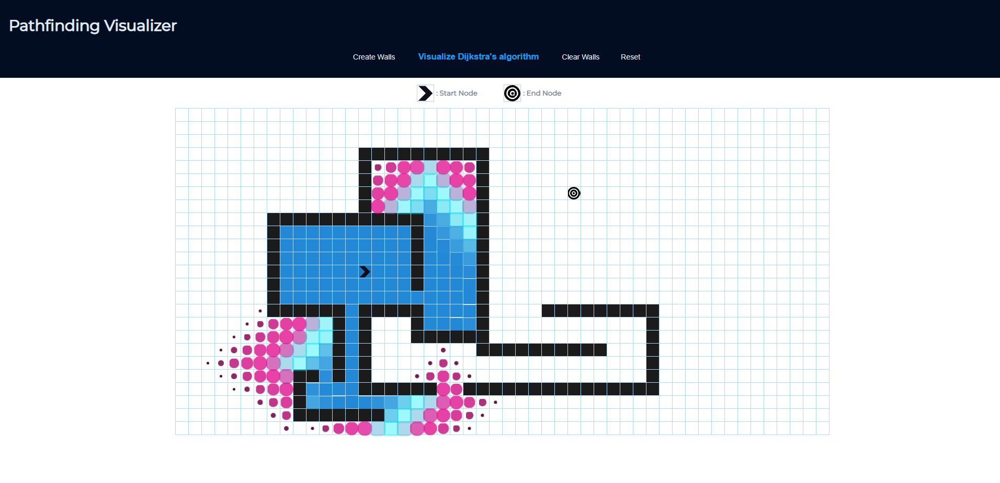

# My Personal Project

## Pathfinding Visualizer

### What will the application do?

**Example:**

It will show the process of a pathfingin algorithm searching for a node on a graph. Users will be able to add walls between the start and end points and the algorithm will have to navigate around the walls to reach the end node. Once the algorithm has found the end node, it will draw out the path (sometimes the shortest path, depending on the algorithm) from start to end. 

Algorithms I could simulate:
- A* (this is the first one I will try)
- Depth-first
- Breadth-first
- Greedy Best-first

### Who will use it?

- People interested in how pathfinding algorithms work
- People looking to compare the strengths/weakness of different pathfinding algorithms

### Why is this project of interest to you?

- I like visualizations that look cool
- I like projects I could put in my portfolio

### User Stories

**Phase 1**

- As a user, I want to be able to add a Node (of type wall) to my Graph (arbitary X to Y)
- As a user, I want to be able to view the Nodes (of type wall) I have added to the graph (view Xs in Y)
- As a user, I want to be able to move the start and end positions
- As a user, I want to be able to remove all the Nodes (of type wall)
